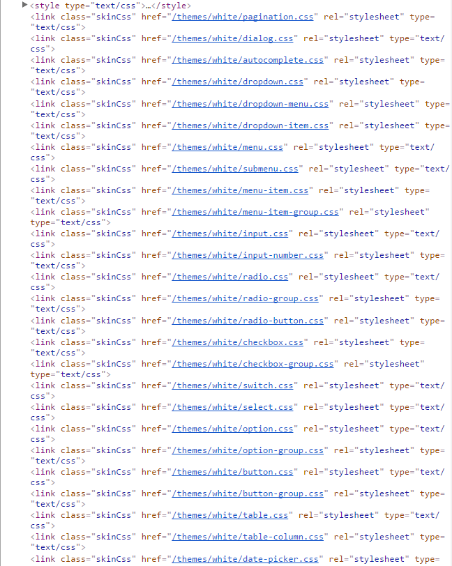

### 换肤方案： 此方案已不不做考虑
#### 1.安装工具
```
    npm install elment-theme element-theme-chalk -D
```
#### 2. 初始化变量文件
```js
// 文件夹需要自己创建 /themes/black
    .\node_modules\.bin\et -i themes/black/black.scss 
```
其会生成element的scss变量
```scss
// 例如：
/* Element Chalk Variables */

/* Transition
-------------------------- */
$--all-transition: all .3s cubic-bezier(.645,.045,.355,1) !default;
$--fade-transition: opacity 300ms cubic-bezier(0.23, 1, 0.32, 1) !default;
$--fade-linear-transition: opacity 200ms linear !default;
$--md-fade-transition: transform 300ms cubic-bezier(0.23, 1, 0.32, 1), opacity 300ms cubic-bezier(0.23, 1, 0.32, 1) !default;
$--border-transition-base: border-color .2s cubic-bezier(.645,.045,.355,1) !default;
$--color-transition-base: color .2s cubic-bezier(.645,.045,.355,1) !default;

/* Colors
-------------------------- */
$--color-white: #fff !default;
$--color-black: #000 !default;
        ...

```
#### 3. element编译主题
```js
    // 创建在种子工程public文件夹下在打包时vue会自动到包在dist目录下
  .\node_modules\.bin\et -c themes/black/black.scss -o public/themes/black


    // 实时监听编译
    .\node_modules\.bin\et -w -c themes/black/black.scss -o public/themes/black
```
```js
// 目录结构
public/
| - ...
| - themes/                       <!--皮肤包文件夹-->
| | |- black/
| | | |-fonts/
| | | |-element-icons.ttf         <!--element字体图标ttf文件-->
| | | |-element-icons.woff        <!--element字体图标woff文件-->
| | | - alert.css                 <!--弹出框样式-->
| | | - aside.css                 <!--侧边栏样式-->
```
#### 4. gulp 打包全局自定义样式
在gulpfile.js
```js
    // 皮肤打包使用
    const sass = require('gulp-sass');
    // 皮肤打包路径
    const skinUrl = './themes/**/*.scss';
    // 皮肤打包
    gulp.task('skinCss', function() {
    gulp.src(skinUrl)
        .pipe(sass({style: 'expanded'}))
        .pipe(gulp.dest('./public/themes'));
    });
```
```js
// 目录结构
public/
| - ...
| - themes/                       <!--皮肤包文件夹-->
| | |- black/
| | | |-element-icons.ttf         <!--element字体图标ttf文件-->
| | | |-element-icons.woff        <!--element字体图标woff文件-->
| | | - alert.css                 <!--弹出框样式-->
| | | - aside.css                 <!--侧边栏样式-->
      ......
| | | - themes.css                 <!--全局自定义样式-->
| | | - black.css                  <!--！！！实际为空文件-->
| | | - angolaico.css              <!--字体文件-->
```

#### 5. 切换方法
```js
// 文件目录结构
src/
| - ...
| - skin/              <!--皮肤包文件夹-->
| | |- skin.ts          <!--切换方法-->
| | |- themeArray.ts   <!--element 打包后生成的css 数组文件名-->
```
```js
// 在themeArray中
// 主题文件数组
const themeArray = [
  'Pagination',
  'Dialog',
  'Autocomplete',
    ...
//   'collapse-item',           // 若自己未用到该组件加载可注释
//   'Cascader',
//   'color-picker',
  'Loading',
  'message-box',
  'Message',
  'Themes',
];
export default themeArray;
```
```js
  changeTheme(themeValue: any) {
    // 需要移到单独的文件存放
    const cssArray = themeArray;
    const head = document.getElementsByTagName('head')[0];
    const skinCssArray = document.getElementsByClassName('skinCss');
    // 切换移除操作， 效果为不太理想 图片出现闪烁效果，字体图标占位部分会塌陷
    // for ( let  i = 0, len = skinCssArray.length; i < len; i++  ) {
    //   head.removeChild(skinCssArray[0]);
    // }
    for (let i = 0, len = cssArray.length; i < len; i++) {
      const itemPath = '/themes/' + themeValue.toLowerCase() + '/' + cssArray[i].toLowerCase() + '.css';
      this.loadCss(itemPath);
    }
    localStorage.setItem('themeValue', themeValue);
  },
  loadCss(path: string) {
    // 动态创建link 标签，加载css资源路径
    const head = document.getElementsByTagName('head')[0];
    const link = document.createElement('link');
    link.setAttribute('class', 'skinCss');
    link.href = path;
    link.rel = 'stylesheet';
    link.type = 'text/css';
    head.appendChild(link);
  }
};
```
切换页面：
```js
// 设定参数
private skins: Array<any> = [
    { name: 'white', label: 'white' },
    { name: 'black', label: 'black' },
];
// 调用方法
 Skin.changeTheme(this.skins.name)
```
DOM呈现


#### 6. 自有样式参与自定义主题的切换
##### 6.1 全局样式
解释： 由于我们在变量文件的编译中，需要使用gulp/element 第三方打包，所以需要将需要换肤的属性提取出来，单独做为一个文件 `themes.scss`,再在其中引入变量，使用gulp/element 打包。
##### 6.2. logo(背景图片)
1. 使用background-image的方式引用
2. 需要将图片资源放置在种子工程中的`public`中；
```scss
// 此处路径使用打包后路径 且未经过vue自身编译，不会出现hash随机数
$logo-background: url('/images/logo.png') !default;

.logo-box{
    background:  $logo-background;
    transition: all 0.3s cubic-bezier(0.645, 0.045, 0.355, 1);
}
```
注意： 若我们使用skinCss样式切换（删除，重新生成）则会出现闪烁效果，并且它的过度效果不会显示。  
       若我们使用skinCss样式覆盖（重新生成link标签）则会出现闪烁效果，并且它的过度效果不会显示。

##### 6.3字体图标
1. themes中加入自定义iconfont的文件例如: "angolaico.scss"
2. 将自定义字体文件 放入 `public/themes/icons`中  
3. 修改iconfont引用路径
```scss
@font-face {
  font-family: 'Angola-ico';
  src:  url('../icons/Angola-ico.eot?ty0r3z');
  src:  url('../icons/Angola-ico.eot?ty0r3z#iefix') format('embedded-opentype'),
    url('../icons/Angola-ico.ttf?ty0r3z') format('truetype'),
    url('../icons/Angola-ico.woff?ty0r3z') format('woff'),
    url('../icons/Angola-ico.svg?ty0r3z#Angola-ico') format('svg');
  font-weight: normal;
  font-style: normal;
}
```
4. 使用方式为
```html
    <i class="icon-Patrol-control-plan-management" style="font-size:25px"></i>
    <el-button type="primary" class="icon-Patrol-control-plan-management">图标改变</el-button>  
```
注意：若我们使用skinCss样式切换（删除，重新生成）则会出现高宽度塌陷导致页面整体结构改变。  
     若我们使用skinCss样式覆盖（重新生成link标签）则不会出现上述问题。  
     在测试中，切换可能会出现字体图标整体消失的情况；  

#### 后续考虑事宜
1. 生成的css文件最后统一打包；
2. 在全局需要换肤的样式需要编写样式时提取，还是最后完成后提取；